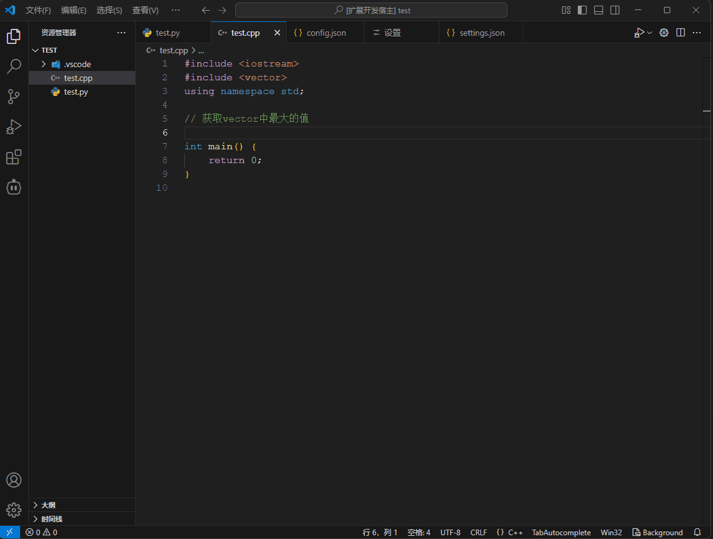

# TabAutoComplete - VSCode智能代码补全扩展

[English Version](README_EN.md)

## 简介

TabAutoComplete 是一个强大的 VSCode 扩展，它可以连接到本地或云端的 AI 模型（支持 Ollama、DeepSeek、OpenAI 和 SiliconFlow），提供智能的、上下文相关的代码补全功能。通过使用最先进的大语言模型，为您提供更智能、更准确的代码建议。

## 演示



## 功能特点

- 🚀 **智能代码补全** - 基于上下文自动补全代码，支持多种编程语言
- 🔄 **Tab键补全** - 使用Tab键快速接受补全建议
- 🌐 **多模型支持** - 支持本地和云端AI模型
- ⚙️ **高度可定制** - 灵活配置模型参数、触发时机和上下文大小
- 📚 **智能上下文** - 自动分析代码上下文，提供更相关的补全
- 💾 **智能缓存** - 缓存常用代码片段，提高响应速度
- 🎯 **文件类型过滤** - 可配置启用/禁用特定文件类型的代码补全

## 前提条件

使用此扩展前，您需要：

1. 对于本地模型：安装并运行 [Ollama](https://github.com/ollama/ollama)
2. 对于云端模型：获取相应服务商（DeepSeek、OpenAI 或 SiliconFlow）的 API 密钥

## 安装

1. 在 VSCode 扩展市场中搜索 "TabAutoComplete"
2. 点击安装
3. 重启 VSCode（如需要）

## 快速开始

1. 确保您选择的 AI 服务已正确配置
2. 打开 VSCode 设置，搜索 "TabAutoComplete" 配置你的模型和首选
3. 开始编码，输入一些代码，稍等片刻（默认300ms），自动补全将会出现
4. 按 `Tab` 键接受建议的代码
5. 按 `Esc` 键忽略补全建议

## 配置选项

### 配置参考示例

```json
{
    "tabAutoComplete.models": [
        {
            "title": "qwen2.5-coder:7b",
            "provider": "ollama",
            "model": "qwen2.5-coder:7b",
            "apiBase": "http://localhost:11434"
        },
        {
            "title": "Qwen/Qwen2.5-Coder-7B-Instruct",
            "provider": "openai",
            "model": "Qwen/Qwen2.5-Coder-7B-Instruct",
            "apiBase": "https://api.siliconflow.cn/v1",
            "apiKey": "xxx"
        }
    ],
    "tabAutoComplete.selectedModelIndex": 1,
    "tabAutoComplete.model.selectedModelName": "Qwen/Qwen2.5-Coder-7B-Instruct"
}
```

上述配置展示了如何同时配置本地Ollama模型和云端模型（以SiliconFlow为例）。您可以根据需要配置多个模型，并通过`selectedModelIndex`选择当前使用的模型。

### 通用设置

- `tabAutoComplete.general.enabled`: 启用或禁用代码补全功能
- `tabAutoComplete.general.triggerDelay`: 触发代码补全的延迟时间（毫秒）
- `tabAutoComplete.debounceDelay`: 输入防抖延迟时间（毫秒）

### 模型设置

- `tabAutoComplete.models`: 可用的AI模型配置列表
- `tabAutoComplete.model.temperature`: 生成的温度参数 (0-1)
- `tabAutoComplete.model.maxTokens`: 每次补全生成的最大 token 数
- `tabAutoComplete.model.selectedModelName`: 当前选择的模型名称

### 上下文设置

- `tabAutoComplete.context.maxLines`: 提供给模型的上下文最大字符数
- `tabAutoComplete.context.includeImports`: 是否在上下文中包含导入/引用语句
- `tabAutoComplete.context.includeComments`: 是否在上下文中包含注释

### 缓存设置

- `tabAutoComplete.cache.enabled`: 是否启用代码补全缓存
- `tabAutoComplete.cache.retentionPeriodHours`: 缓存保留时间（小时）
- `tabAutoComplete.cache.maxSnippets`: 最大缓存条目数

### 文件类型设置

- `tabAutoComplete.fileTypes.enabled`: 启用代码补全的文件类型
- `tabAutoComplete.fileTypes.disabled`: 禁用代码补全的文件类型

### 高级设置

- `